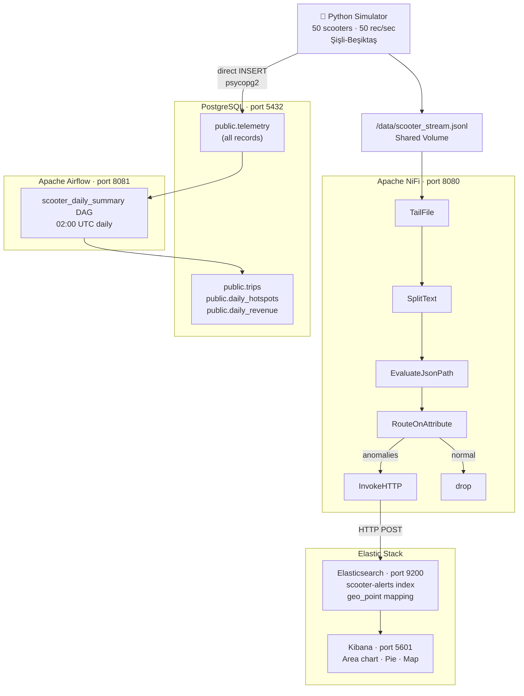

# System Architecture

**YZV 322E — Applied Data Engineering, Spring 2026**
Yusuf Oğuz & Yusuf Öksüzer

## Pipeline Overview

## Data Flow

| Step | From | To | Method |
|------|------|----|--------|
| Raw telemetry | Simulator | PostgreSQL `public.telemetry` | psycopg2 batch INSERT |
| Stream file | Simulator | `/data/scooter_stream.jsonl` | RotatingFileHandler |
| Real-time routing | NiFi TailFile | Elasticsearch `scooter-alerts` | HTTP POST (anomalies only) |
| Nightly aggregation | Airflow DAG | `public.trips`, `public.daily_hotspots`, `public.daily_revenue` | SQL via PostgresOperator |

## Services

| Service | Image | Port | Role |
|---------|-------|------|------|
| `simulator` | custom (`python:3.12-slim`) | — | Emits 50 scooter records/sec |
| `nifi` | `apache/nifi:1.25.0` | 8080 | Real-time stream routing |
| `elasticsearch` | `elasticsearch:8.13.4` | 9200 | Anomaly document store |
| `kibana` | `kibana:8.13.4` | 5601 | Live dashboard |
| `postgres` | `postgres:16` | 5432 | Raw telemetry + aggregates |
| `airflow-webserver` | `apache/airflow:2.9.1` | 8081 | DAG UI |
| `airflow-scheduler` | `apache/airflow:2.9.1` | — | DAG execution |
| `pgadmin` | `dpage/pgadmin4:8` | 5050 | PostgreSQL GUI |
| `nifi-setup` | `curlimages/curl` | — | One-shot NiFi flow creator |
| `es-setup` | `curlimages/curl` | — | One-shot index + mapping creator |
| `kibana-setup` | `curlimages/curl` | — | One-shot dashboard importer |
